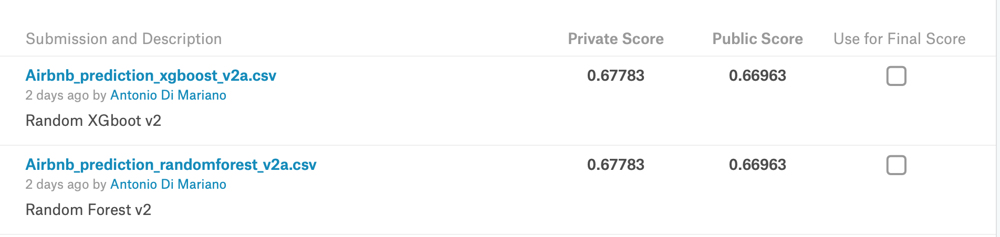
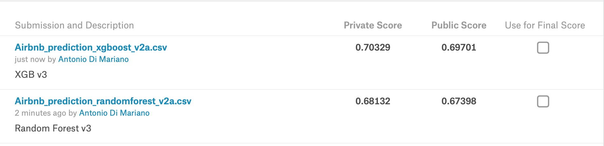
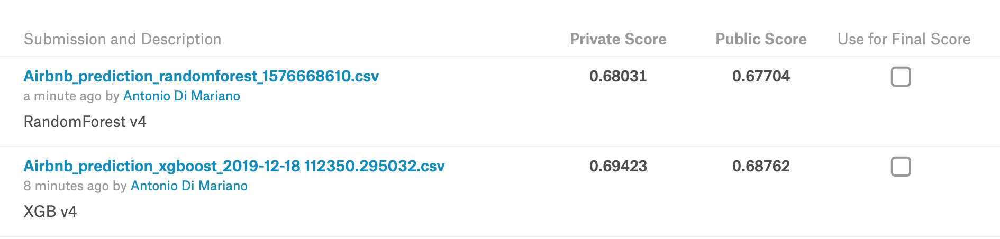

# Description 
Challenge 04 AirBnb New User Booking

New users on Airbnb can book a place to stay in 34,000+ cities across 190+ countries. 
By accurately predicting where a new user will book their first travel experience, Airbnb can share more personalized content with their community, decrease the average time to first booking, and better forecast demand.
In this exercise, Airbnb challenges you to predict in which country a new user will make his or her first booking.

Kaggle page link:
https://www.kaggle.com/c/airbnb-recruiting-new-user-bookings/data


**IMPORTANT**

Please copy the `https://www.kaggle.com/c/airbnb-recruiting-new-user-bookings/data` data to the `airbnb-recruiting-new-user-bookings`
The program generates output files that are stored in the following folders 

* `data_analysis_graph`: contains all the graphs plotted from the original data loaded from the folder `airbnb-recruiting-new-user-bookings`
* `csv_results`: contains the csv files generated as a result of the predictions. Predictions are made using the RandomForest and XGB Classifier
 
## Kaggle scores 

## A few notes after the initial data investigation 

From the analysis of the data and the graphs we can highlight the following conclusions

* most of the users are english or they use the english version of the website at least 
* most of the users use the basic website authentication or facebook 
* the majority of the reservations are made between May and June
* users usually create their account from June to September 
* the median age is ~ 33

In my first attempt I transformed I transformed the users' age > 100 and < 18 to NaN. 
The score I got on Kaggle was 



After a few other attempts and analysis of the data, I transformed the users'age > 90 and < 18 to NaN, obtaining a higher score on kaggle



While, if I work with users'age > 69 and < 18 to Nan I got a lower score but higher than the first attempt




# Requirements 
* Python 3.6 or higher

# How to run 

```
python main.py 
```